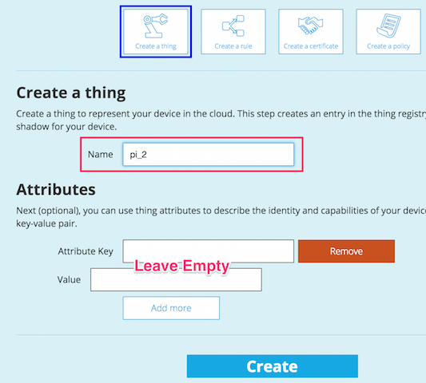

# How to connect a Raspberry Pi to the AWS Iot Platform
by @sreid.

## Intro
This is a simple getting started guide to setting up a Raspberry Pi to connect to the AWS Iot platform. 

## Pre-reqs:
- Raspberry Pi with a working install of Raspbian
- SSH or command line interfaces to the Pi

## How To

### Install Node
NodeJS is not currently in the Pi sources, however it can be easily with the following steps:

```
wget http://node-arm.herokuapp.com/node_latest_armhf.deb
sudo dpkg -i node_latest_armhf.deb
node -v # v4.0.0
```

(based on instructions found [here](http://www.andrewconnell.com/blog/setup-node-js-on-raspberry-pi-2-b
))

### Create your working directory
For the code files, as well as for the certificates.

```
mkdir ~/aws-iot && cd ~/aws-iot
mkdir ~/aws-iot/certs
```

### Install the AWS SDK

NOTE: At the moment, the official Node package has a syntax error. Try this alternative fork from Github until [this issue](https://github.com/aws/aws-iot-device-sdk-js/pull/2) is resolved.

```
npm install https://github.com/gmdayley/aws-iot-device-sdk-js
```

Note: Two failures for optional dependencies occured, however, it appears these can be ignored for now. Watch [this issue](https://github.com/aws/aws-iot-device-sdk-js/issues/4) for updates:

```
...
npm WARN optional dep failed, continuing utf-8-validate@1.1.0
npm WARN optional dep failed, continuing bufferutil@1.1.0
...
```
### IoT Platform Setup
In the console, created a "Thing" called "pi_2".


Then on that thing's detail view, "Connect a Device"


Choose "NodeJS" and click "Generate Certificate & Policy". This will create a keypair, as well as add a policy to the pi_2 thing.

Be sure to download the certificate, public key, & private key to your computer.

###Copy Certificates to the Pi

Copy the `<your-cert>-certificate.pem.crt` and the `<your-cert>-private.pem.key` files to the `~/aws-iot/certs` directory on your Pi

Also, grab the AWS CA certificate that's available from Symantec. This is for the MQTT client to verify it is connecting to a valid, Amazon controlled, server.

```
curl https://www.symantec.com/content/en/us/enterprise/verisign/roots/VeriSign-Class%203-Public-Primary-Certification-Authority-G5.pem > certs/rootCA.pem
```

### Setup Test Script
The pi.js script in this repository will report the Pi's local IP using the AWS IoT platform. You can grab a copy from this repository here:

```
curl https://raw.githubusercontent.com/sreid/aws-iot-raspberry-pi-how-to/master/pi.js > pi.js
```

Edit the file and update the config block to match your setup:
```
var thingShadows = awsIot.thingShadow({
   keyPath: './certs/<your_cert>-private.pem.key',
  certPath: './certs/<your_cert>-certificate.pem.crt',
    caPath: './certs/rootCA.pem',
  clientId: myThingName,
    region: 'us-east-1'
});
```

### Run It!
In the ~/aws-iot directory, run:

```
node pi.js

# Sample Output
Connected...
Registering...
Updating my IP address...
Update:pi_1-0
received accepted on pi_1: {"state":{"reported":{"ip":"192.168.2.247"}},"metadata":{"reported":{"ip":{"timestamp":1444691875}}},"timestamp":1444691875}
```

You should be able to then go to the AWS IoT console, and see the updated state information in the thing details.

## Common Issues
TBD

## Feedback
Questions? Comments? Problems? Don't hesistate to get in touch. GitHub issues and pull requests are welcome. --@sreid
